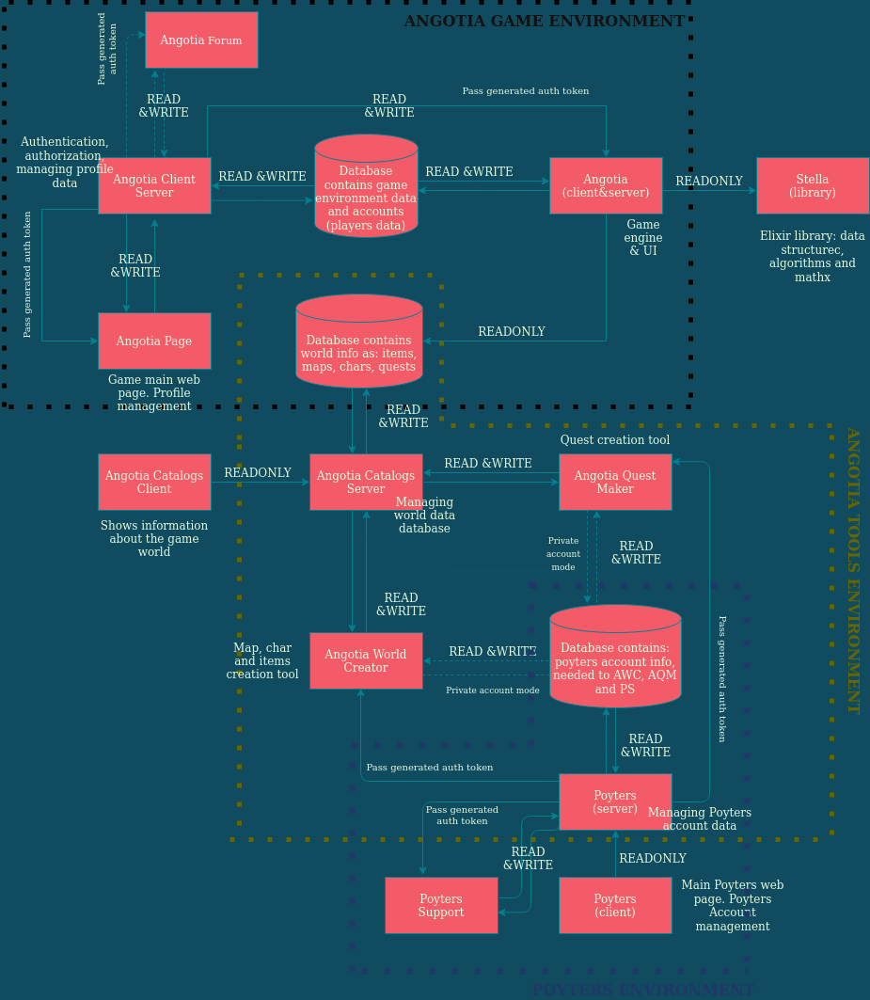

# Angotia Resources
Angotia Resources is web site that gives each Angotia player possibility to check out all game data like npc, mob, items, quests and maps. Its also really hopefull for World Creators.

## What is Angotia?
Angotia is MMORPG browser game crafted from scratch by Rafał Kostecki.

### About Angotia ecosystem

## Installation (API)
- clone repository to your PC
- run `mix deps.get` to get all dependences
- run `mix mhx.server` to listen application
- right now application is running on `http://0.0.0.0:4000` and graphQL CLI is running on `http://0.0.0.0:4000/graphiql`

## Technology behing the Angotia Resources API

### Backend
- **Elixir** - Rapid, multi concurrent language - a brilliant fit for an API which need to handle a lot of concurrent requests.
- **Ecto** - Set up tools to work with SQL database. Without it, I would need to write them by hand.
- **Absinthe** - This API can be used in a variety of ways, so using GraphQL seems like a natural choice to transfer responsibility for API responses to the client side. Thanks to that, Resources API is flexible for another microservices.

### Database
- **PostgreSQL** - The choice of SQL database was brilliant. The game stores a lot of data that is consistent and predictable. In this case, PostgreSQL benefit from the *ACID* model and *distributed transactions*.

